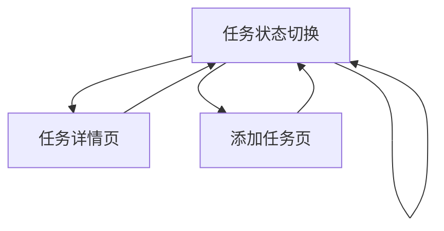

# Todo List 全栈项目产品需求文档

## 1. Product Overview
一个现代化的待办事项管理应用，帮助用户高效管理日常任务。使用最新的技术栈构建，包括Remix前端框架和ASP.NET Core后端API。
- 解决用户任务管理混乱的问题，提供简洁直观的界面让用户轻松添加、编辑和完成任务。
- 面向需要任务管理的个人用户，通过现代化的Web应用提升工作效率。

## 2. Core Features

### 2.1 User Roles
本项目采用简化的用户模式，不区分复杂的用户角色：

| Role | Registration Method | Core Permissions |
|------|---------------------|------------------|
| Default User | 直接访问应用 | 可以创建、查看、编辑、删除待办事项 |

### 2.2 Feature Module
我们的Todo List应用包含以下核心页面：
1. **主页面**：任务列表展示、任务状态切换、快速添加任务
2. **任务详情页**：任务详细信息编辑、任务描述管理
3. **添加任务页**：新任务创建表单、任务属性设置

### 2.3 Page Details

| Page Name | Module Name | Feature description |
|-----------|-------------|---------------------|
| 主页面 | 任务列表 | 显示所有待办事项，支持按状态筛选（全部、待完成、已完成） |
| 主页面 | 任务操作 | 标记任务完成/未完成、删除任务、快速编辑任务标题 |
| 主页面 | 快速添加 | 在页面顶部提供快速添加任务的输入框和按钮 |
| 任务详情页 | 详情编辑 | 编辑任务标题、描述、优先级、截止日期等详细信息 |
| 任务详情页 | 状态管理 | 更改任务状态、查看任务创建和修改时间 |
| 添加任务页 | 任务创建 | 创建新任务，设置标题、描述、优先级、截止日期 |
| 添加任务页 | 表单验证 | 验证必填字段、日期格式、字符长度限制 |

## 3. Core Process

用户主要操作流程：
1. 用户访问主页面，查看当前所有待办事项
2. 用户可以通过快速添加功能直接在主页面添加简单任务
3. 用户可以点击"添加任务"按钮进入详细的任务创建页面
4. 用户可以点击任务项进入任务详情页面进行编辑
5. 用户可以在主页面直接标记任务完成状态或删除任务
6. 用户可以使用筛选功能查看不同状态的任务

## 4. User Interface Design

### 4.1 Design Style
- **主色调**：蓝色系（#3B82F6）作为主色，灰色系（#6B7280）作为辅助色
- **按钮样式**：圆角按钮，支持悬停效果和点击反馈
- **字体**：系统默认字体栈，标题使用16-24px，正文使用14-16px
- **布局风格**：卡片式布局，顶部导航，响应式设计
- **图标风格**：使用简洁的线性图标，支持状态变化动画

### 4.2 Page Design Overview

| Page Name | Module Name | UI Elements |
|-----------|-------------|-------------|
| 主页面 | 任务列表 | 卡片式任务项，包含复选框、任务标题、优先级标签、操作按钮 |
| 主页面 | 快速添加 | 顶部固定的输入框，带有添加按钮，支持回车快速提交 |
| 主页面 | 筛选器 | 标签页式筛选器（全部、待完成、已完成），带有任务计数 |
| 任务详情页 | 编辑表单 | 表单布局，包含文本输入、下拉选择、日期选择器 |
| 添加任务页 | 创建表单 | 垂直表单布局，清晰的字段标签，实时验证反馈 |

### 4.3 Responsiveness
应用采用移动优先的响应式设计，在桌面端提供更丰富的交互体验，在移动端优化触摸操作和屏幕空间利用。